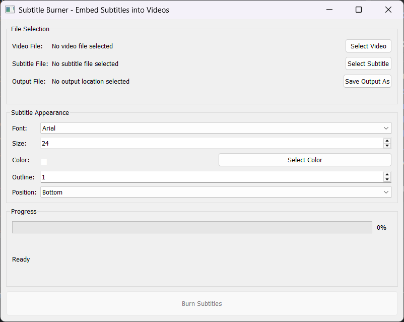

# Subtitle Burner

A powerful desktop application that permanently embeds subtitles into video files with customizable appearance options.



## Features

- User-friendly graphical interface
- Support for popular video formats (MP4, AVI, MKV, MOV, WMV)
- Compatible with common subtitle formats (SRT, ASS, SSA, VTT)
- Customizable subtitle styling:
  - Font selection
  - Font size
  - Font color
  - Outline width
  - Position (Bottom, Top, Middle)
- Real-time progress tracking
- High-quality output with minimal quality loss

## Requirements

- Python 3.6+
- FFmpeg (must be installed and in system PATH)
- PyQt5

## Installation

1. Clone this repository
```bash
git clone https://github.com/yourusername/subtitle-burner.git
cd subtitle-burner
```

2. Install required Python packages
```bash
pip install PyQt5
```

3. Install FFmpeg

**Windows:**
- Download from [ffmpeg.org](https://ffmpeg.org/download.html)
- Extract to a folder (e.g., `C:\ffmpeg`)
- Add the `bin` folder to your system PATH

**macOS:**
```bash
brew install ffmpeg
```

**Linux:**
```bash
sudo apt update
sudo apt install ffmpeg
```

## Usage

1. Launch the application
```bash
python Subtitle_Burner_Gui.py
```

2. Select your video file
3. Select your subtitle file
4. Choose output location
5. Customize subtitle appearance:
   - Select font type and size
   - Choose font color
   - Set outline width
   - Select position (Bottom, Top, Middle)
6. Click "Burn Subtitles" to start processing
7. Monitor progress through the progress bar

## How It Works

Subtitle Burner uses FFmpeg to permanently embed subtitles into video files. The application provides a user-friendly interface to customize subtitle appearance and handles the complex FFmpeg commands in the background.

## License

This project is licensed under the MIT License - see the [LICENSE](LICENSE) file for details.

## Acknowledgements

- [FFmpeg](https://ffmpeg.org/) - The powerful multimedia framework used for subtitle burning
- [PyQt5](https://www.riverbankcomputing.com/software/pyqt/) - Cross-platform GUI toolkit
